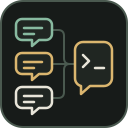
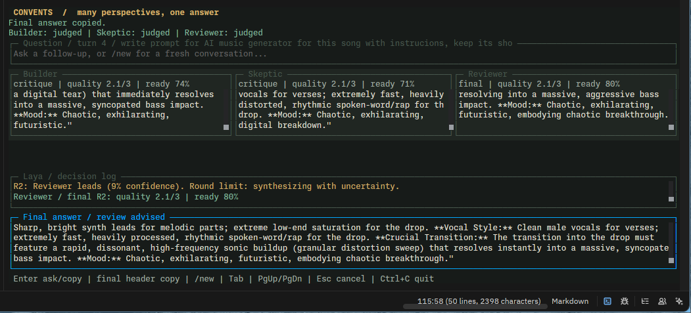

<p align="center">
  
</p>

<h1 align="center">Convents</h1>

<p align="center">
  <a href="https://bun.sh"></a>
  <a href="https://www.typescriptlang.org"></a>
  <a href="https://github.com/anomalyco/opentui"></a>
  <a href="https://ai-sdk.dev"></a>
</p>

A Bun terminal app where configured LLMs propose solutions concurrently, critique each other's answers, and let Laya select a candidate to synthesize a final response.



```sh
cp config.example.toml config.toml
bun install
bun run start
bun run start --ask "How should I back up a small SQLite database?"
bun run start --config config.toml
bun test
bun run typecheck
```

## Configuration

`config.toml` includes three runnable seats at `http://127.0.0.1:8888/v1` and the Laya decision endpoint at `http://127.0.0.1:8889/v1/systemone`. The demo uses the **same local model with different roles**, not three independent models. Replace each seat's `base_url` and `model` to use different providers or models. Check model IDs with `GET /v1/models` on your servers.

```toml
[[llms]]
name = "Engineer"
base_url = "https://your-provider.example/v1"
model = "your-model-id"
api_key_env = "ENGINEER_API_KEY"
role = "Check feasibility and propose a practical implementation."
```

Store credentials in environment variables or `.env`, which Bun loads automatically. `api_key_env` is optional for both LLM seats and `[decision]`; if configured, its environment variable must exist. Never put credentials in committed TOML.

`extra_body` optionally adds provider-specific request fields. The included llama.cpp demo uses `chat_template_kwargs.enable_thinking = false` to avoid spending its output budget on hidden reasoning. Remove that field for providers that do not support it. The UI displays public proposals and critiques, not private reasoning traces.

`decision.url` is the **exact POST endpoint**. Convents uses the typed `score`, `noul`, and `choice` requests from `example.md`, not a chat completion request. It validates Laya's response types and numeric ranges.

## Tools

Each `[[llms]]` seat can enable its own tools. The configs include this commented example:

```toml
# tools = ["write", "edit", "read", "bash", "websearch"]
```

Uncomment it or choose a smaller list, such as `tools = ["read", "websearch"]`. Tools default to disabled. Unknown names and duplicates are configuration errors. The provider and model must support tool calling.

- `read` reads UTF-8 files up to 64 KiB or lists directories.
- `write` creates or atomically replaces files up to 128 KiB.
- `edit` replaces one exact `old_text` match with `new_text`. Missing or ambiguous matches leave the file unchanged. The file and result must fit 128 KiB.
- `bash` runs commands for up to 30 seconds, with 64 KiB of output per stream.
- `websearch` returns up to five DuckDuckGo titles, links, and snippets. It never opens result links. DDG rate limits and CAPTCHA blocks appear as tool errors.

Filesystem tools and bash require **Linux x64 or arm64, bubblewrap, and enabled unprivileged user namespaces**. Install `bubblewrap` through your distribution's package manager. If the sandbox cannot start, these tools do not run. There is no unsandboxed fallback.

The sandbox mounts the directory where you launched Convents at `/workspace`. File-tool paths must be relative to it. Bash shares that host directory, with read-only system binaries and libraries plus private temporary storage. Other host directories and processes are not exposed. The sandbox clears the inherited environment and blocks network sockets, including Unix sockets. Web search uses a separate request to a fixed DDG endpoint, with redirects disabled.

All seats share the same working directory. Changes persist. Enable write, edit, and bash only for models you trust, since bash can also remove project files. Files inside the working directory, including `.env` files, are accessible to enabled tools and their contents can reach your LLM providers. Use a separate project directory rather than the Convents source checkout when you want models to edit another project:

```sh
cd /path/to/project
bun /path/to/convents/index.ts --config /path/to/config.toml
```

Each response permits at most five model steps. Tool activity appears in the TUI and CLI. Laya rates tool-request responses as well as the completed answer. The sandbox limits runtime and output, but it is not a CPU or memory quota.

## Flow and controls

1. All seats start independent proposals together. Each completed response goes to Laya for quality (0 to 3) and readiness (0 to 1) ratings.
2. Laya chooses the strongest candidate. Every seat receives the previous round's responses and ratings and critiques them concurrently.
3. After at least one peer-critique round, the chosen candidate's readiness can end the debate early. `max_rounds` (2 to 8) always bounds it. At the limit, synthesis proceeds even if readiness is low.
4. The selected model synthesizes the final answer, which also goes to Laya. Low readiness or token truncation is visibly flagged. Ratings are model estimates, not proof of correctness or guaranteed consensus.

Enter submits a question. Tab or Shift+Tab focuses panels for keyboard scrolling. Page Up/Down scroll the focused panel, or the final answer while the input is focused. Mouse scrolling and text selection work in panels. Escape cancels active requests; Ctrl+C exits and restores the terminal. Each question runs a new debate within the same conversation: previous completed questions and final answers are sent to every LLM and to Laya. The final-answer pane keeps a scrollable conversation transcript. Type `/new` between turns to clear both context and transcript; if a debate is active, cancel with Escape first. Failed or cancelled turns are not added to model context. History stays in memory only and is lost when the app closes; `--ask` remains a one-shot request.

Click the **Final answer** pane's top border to copy the latest completed answer, or focus that pane with Tab and press Enter. Only the answer is copied, not the question, ratings, or earlier turns; dragging within the body still selects text normally. Clipboard writes use OpenTUI's native system clipboard locally, with a terminal OSC 52 fallback; remote sessions use OSC 52. Terminal copying must be enabled in your terminal, and a “sent to terminal clipboard” status confirms dispatch, not acceptance. Copy failures are shown in the status line.

Each generation and decision request has a configurable `timeout_ms`. An LLM or Laya failure stops the run and cancels outstanding requests, rather than silently omitting a participant or inventing a judgment. One seat is supported, though peer debate needs at least two. Only the previous debate round is shared, alongside the full completed conversation history. Long conversations can exceed an LLM's context window or Laya's server-side physical batch size. Use `/new` to reset context or increase the server limits; history is not silently truncated or summarized.

Tests use local mock HTTP servers and OpenTUI's in-memory renderer. They do not require access to the demo servers.
